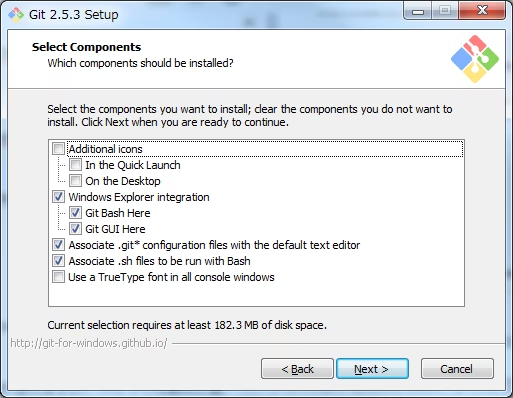

# 01. Init settings
GitHub アカウント作成後にやるべき初期設定についてまとめます。

## GitHub のプロフィール情報を整理する
GitHub ページ右上のアイコンから、メニューを表示して「Settings」を選択


## Git のインストール
まず、現在の PC に Git が入っているかを確認しましょう。

Mac は「ターミナル」、Windows は「コマンドプロンプト」を開きましょう。

確認のためには、以下のコマンドを実行します。

```bash
# Git バージョンを確認するコマンド
git --version

# 以下のように返ってくれば Git はインストール済み
git version 2.37.1
```
上記のように、バージョンの数字が表示されれば既にインストール済みです。
バージョンが返ってこなかったら、未インストール状態なので、インストールしましょう。


### Git インストール（Windows の場合）
以下からインストーラを入手しましょう

Git のダウンロード先
https://git-scm.com/downloads

Git のインストール（基本的にデフォルトの内容のまま "Next" を選んでいくだけでOK）
※ ただし、下記の画面で「`Git Bash Here`」には必ずチェックが入っていることを確認して進めましょう。


### Git インストール（Mac の場合）
Mac は基本的に Git がインストールされている可能性が高いですが、万が一ない場合はインストールしましょう。

#### 方法1. Homebrew を使ったインストール
おすすめのインストール方法は「Homebrew」という専用コマンドを利用したイントールです。
そもそも「Homebrew」が Mac に入っているか、以下のコマンドが実行できるか試してみましょう。

```bash
# Homebrew バージョン確認コマンド
brew -v

# 以下のようにバージョン表示すればインストール済み
Homebrew 3.6.12
```
返ってこなかった場合は、Homebrew をインストールした方が良いですが、少し手順が面倒なので、次の方法を取りましょう。

#### 方法2. 公式のインストーラをしようする（Windows 同様）
Windows を同じく、以下からインストーラを入手しましょう

Git のダウンロード先
https://git-scm.com/downloads

Mac の場合は、Windows のようなインストーラが起動しないので、画面表示に沿ってどんどん進めていきましょう。

### インストールの確認
確認方法は最初と同じです（Windows は今インストールした「Git Bash」を使用しましょう）

```bash
# Git バージョンを確認するコマンド
git --version

# 以下のように返ってくれば Git はインストール済み
git version 2.37.1
```

## Git のアカウント設定
GitHub のアカウント作成に使用した情報を使って以下のコマンドを PC で実行しましょう

```bash
git config --global user.name "{GitHubのユーザ名}"
git config --global user.email {GitHubのメールアドレス}
```

例）実際に実行するコマンド
```bash
git config --global user.name "c-tomioka"
git config --global user.email c_tomioka@ideal-architects.co.jp
```

## SSH 鍵の生成と GitHub への登録
GitHub と PC が簡単かつセキュアに通信できる設定をする。
そのために、① PC の中に「秘密鍵」と「公開鍵」のペアを作り、② GitHub に「公開鍵」を登録する。

### 手順1. PC 内に SSH 鍵を生成する

### 手順2. GitHub に SSH の「公開鍵」を登録する
**※ 注意 ※** 誤って「秘密鍵」を登録しないこと。
